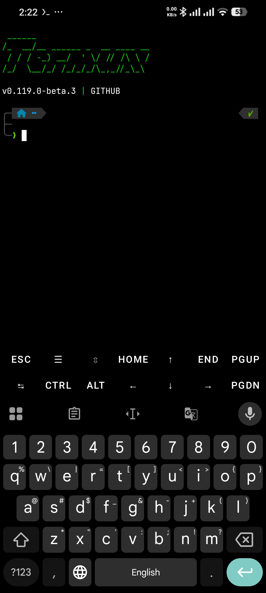

# Termux-zsh



[](https://app.codacy.com/gh/Sohil876/Termux-zsh/dashboard?utm_source=gh&utm_medium=referral&utm_content=&utm_campaign=Badge_grade)

### Installation
```bash
pkg install git && git clone https://github.com/abidhasansojib/Termux_Zsh.git && cd Termux_Zsh && bash setup.sh
```

### Update

-   You can use `omz update` command in termux to update OhMyZsh framework/plugins manually to latest versions, by default it will prompt you automatically if it finds any update available.
-   You can use `p10k-update` command in termux to check and update powerlevel10k theme to latest version, this has to be done manually.
-   You can use `custom-plugins-update` command in termux to check and update all plugins installed in `~/.oh-my-zsh/custom/plugins` directory to latest versions (they need to be a git repo), this has to be done manually.

### Note
This repo is forked from [Here](https://github.com/Sohil876/Termux-zsh) with my own changes.So thanks to [Sohil876](https://github.com/Sohil876) for his work.
